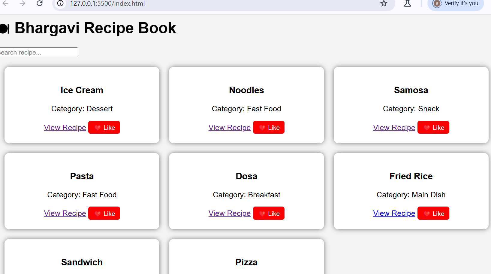

## Project Preview

# 🍽 Recipe Website

This is a simple Recipe Website created using HTML, CSS, and JavaScript.

## 📖 About the Project
The website displays different food recipes in a card layout. Users can search for recipes and open individual pages to see ingredients and preparation steps.

## 🍜 Recipes Included
- Dosa
- Pizza
- Burger
- Noodles
- Samosa
- Pasta
- Fried Rice
- Sandwich
- Ice Cream
- Gulab Jamun

## 🚀 Features
- Simple recipe cards
- Search functionality
- Like button interaction
- Separate pages for each recipe

## 🛠 Technologies Used
- HTML
- CSS
- JavaScript

## 🌐 Live Website
You can view the project using GitHub Pages.

## 👩‍💻 Author
Bhargavi
